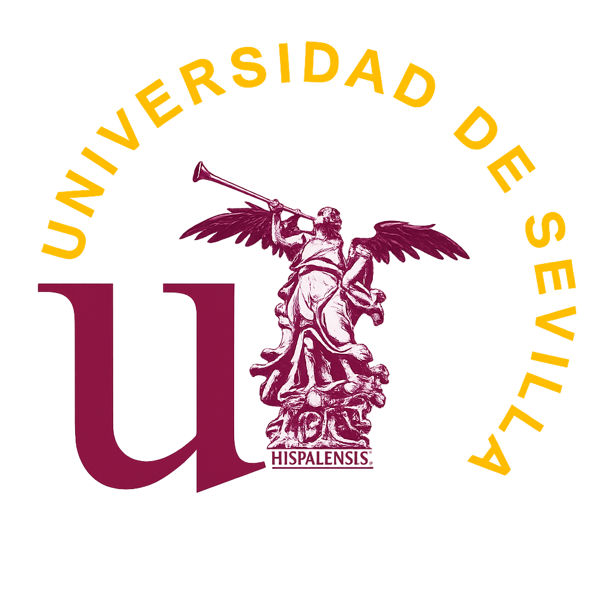

**TFG**  

**UNIVERSIDAD DE SEVILLA**  
**ESCUELA TÉCNICA SUPERIOR DE INGENIERÍA INFORMÁTICA**  

**GRADO EN INGENIERÍA INFORMÁTICA DEL SOFTWARE**  

## Desarrollo de una auditoría de ciberseguridad para PYMEs

---

Este Trabajo Fin de Grado tiene como objetivo principal diseñar un modelo de auditoría de ciberseguridad orientado a pequeñas y medianas empresas (PYMEs), accesible para cualquier tipo de usuarios sin conocimientos técnicos avanzados.

Para ello, se establece un marco teórico que introduce los fundamentos esenciales de la ciberseguridad. En este apartado se analizan las principales amenazas cibernéticas que afectan a las PYMEs, se proponen planes de mitigación y se presentan buenas prácticas orientadas a reducir la superficie de exposición. Además, para quienes estén interesados en formarse en el ámbito de la ciberseguridad ofensiva, se incluyen las certificaciones más reconocidas del sector y una recopilación de herramientas ampliamente utilizadas en entornos profesionales.

Posteriormente, se desarrolla una metodología propia de auditoría basada en la normativa NIST SP 800-115, una de las más reconocidas a nivel internacional en el ámbito de la ciberseguridad. Esta metodología ha sido adaptada mediante el análisis detallado de procedimientos reales empleados por empresas especializadas del sector, con las que se ha mantenido contacto directo a través de reuniones y entrevistas realizadas durante el desarrollo del proyecto.

La propuesta metodológica se valida mediante un caso práctico aplicado a una PYME real, lo que permite demostrar su eficacia y extraer conclusiones prácticas sobre los riesgos detectados y las mejoras necesarias.

Como resultado, se obtiene una guía clara, estructurada y replicable, respaldada por la validación de expertos, que puede utilizarse como referencia para futuras auditorías básicas en entornos similares.
